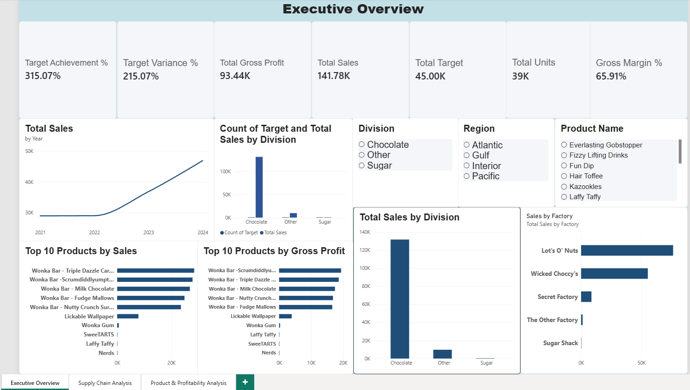
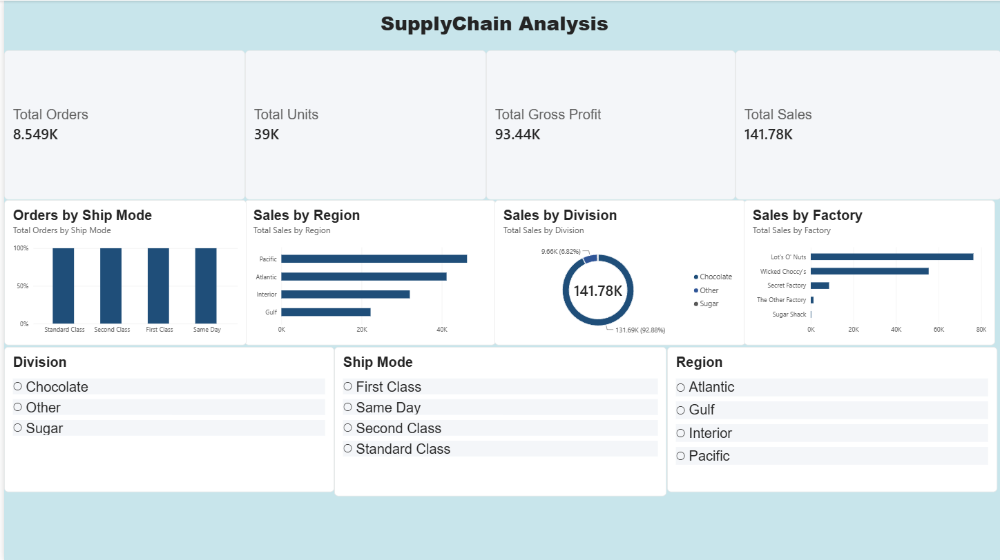
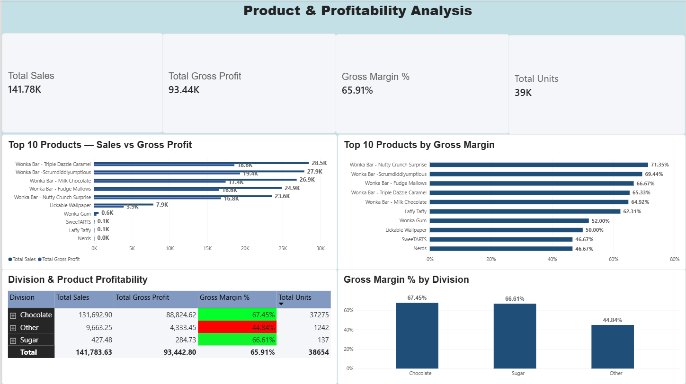

# Candy-Sales-Analytics
Power BI sales, supply chain, and profitability analysis dashboard built using Excel, Power Query, DAX, and data modeling
# Candy Sales Analytics Dashboard

## Project Overview

An interactive Power BI dashboard designed to analyze sales performance, profitability, products, regions, divisions, factories, and shipping operations.

## Tools & Technologies

- Power BI
- Power Query
- DAX
- Data Modeling
- Excel

## Dashboard Pages

### Executive Overview
Provides a high-level view of sales and profitability performance, including KPIs, sales vs. targets, and top-performing products.

### Supply Chain Analysis
Analyzes orders, units, sales by region and division, shipping modes, and factory performance.

### Product & Profitability
Analyzes product sales, gross profit, gross margin, and profitability across divisions and products.

## Key Insights

- Chocolate achieved the highest gross margin at 67%.
- Sugar followed closely at 66%.
- Other products had a lower gross margin of 44%.

## Data Model

The Power BI model connects sales data with product, factory, and target information to enable interactive business analysis.

## Disclaimer

This project was created for portfolio and learning purposes.

## Dashboard Preview

### Executive Overview

### Supply Chain Analysis

### Product & Profitability

## Key Business Insights

- Chocolate achieved the highest gross margin at 67%.
- Sugar followed closely with a gross margin of 66%.
- Other products recorded a significantly lower gross margin of 44%.
- The dashboard enables management to compare sales, profitability, regional performance, shipping methods, and factory performance.
- Interactive filters allow users to drill down from overall business performance to division and product-level results.

## Business Recommendations

- Investigate the cost structure of Other products to understand the lower gross margin.
- Prioritize high-margin product categories while monitoring their sales volume.
- Use regional and factory-level performance to identify opportunities for supply chain optimization.
- Monitor sales and profitability together rather than relying on sales volume alone.
